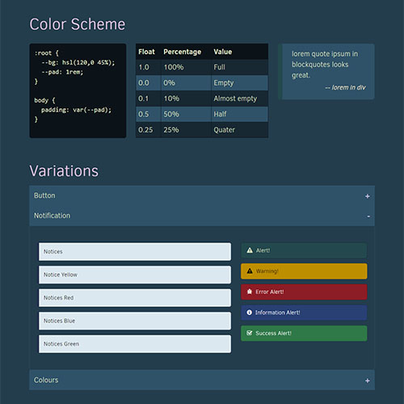
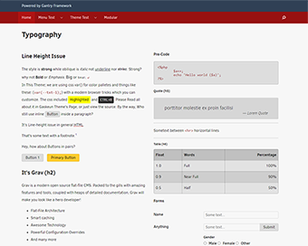
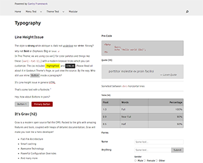
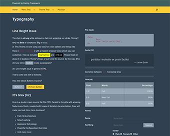

# Gaskeun!

Gaskeun is Grav Gantry 5 Theme for your new website. Base on Hydrogen, the default Gantry 5 theme.
Gaskeun loaded with more options.

<div class='fit'>

</div>

<div class='images'>



</div>

## Functions

## Particles 

## Templates

## Styles Options

## Tips

To copy this theme theme

Use devtools plugins:

```
	bin/plugin devtools newtheme
```

Choose a template type: **copy** Copy another theme
 
Then:
 
```
	$ find ./ -type f -exec sed -i 's/poko/newtheme/g' {} \;
	$ find ./ -type f -exec sed -i 's/poko/newtheme/g' {} \;
	$ find ./ -type f -exec sed -i 's/poko/NEWTHEME/g' {} \;
```

While several 'gaskeun' remain intact.
