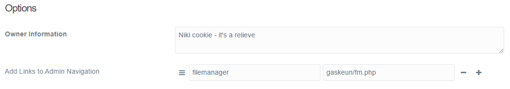

# Gaskeun!

Gaskeun is Grav Gantry 5 Theme for your new website. Base on Hydrogen, the default Gantry 5 theme.
Gaskeun loaded with more options.

<div class='fit'>

</div>

<div class='images'>


</div>

## Key Features

* Sass convert hexcolor to hsl
* Use css3 var(), dynamic theme var
* css3 var() provide color pallete, triadic, analogus, complement, and 8 level of shade.
* Each html sections is constructed styles
* Sass Skeleton 

## Gantry Particles 

## Themes Options



For html header:

```
<meta name="generator" content="GravCMS">
<meta name="description" content="Grav is an easy to use, yet powerful, open source flat-file CMS">
<meta name="owner" content="Niki cookies corner - It's a relieve">
```

To lock the *owner information*, open `blueprint.yaml` on your theme folder, set `readonly` to `true` under `owner` field

```
    owner:
        size: long
        type: textarea
        size: large
        label: Owner Information 
        default: owner information
	readonly: true
```
## Grav Templates

## Tips

To copy this theme theme

Use devtools plugins:

```
	bin/plugin devtools newtheme
```

Choose a template type: **copy** Copy another theme
 
Then:
 
```
	$ find ./ -type f -exec sed -i 's/poko/newtheme/g' {} \;
	$ find ./ -type f -exec sed -i 's/poko/newtheme/g' {} \;
	$ find ./ -type f -exec sed -i 's/poko/NEWTHEME/g' {} \;
```

While several 'gaskeun' remain intact.
