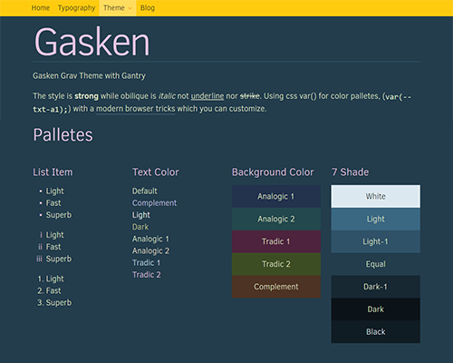
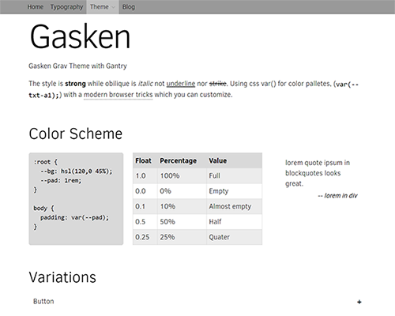

# Gaskeun!

Gaskeun is Grav Gantry 5 Theme for your new website. Base on Hydrogen, the default Gantry 5 theme.
Gaskeun loaded with more options.

<div class='fit'>

</div>

<div class='images'>


</div>

## Tips

To copy this theme theme

Use devtools plugins:

```
	bin/plugin devtools newtheme
```

Choose a template type: **copy** Copy another theme
 
Then:
 
```
	$ find ./ -type f -exec sed -i 's/gasken/newtheme/g' {} \;
	$ find ./ -type f -exec sed -i 's/gasken/newtheme/g' {} \;
	$ find ./ -type f -exec sed -i 's/gasken/NEWTHEME/g' {} \;
```

While several 'gaskeun' remain intact.

<style type="text/css"> 
.fit { width:100% }
.fit a { display:block; }
.fit img { width:100%; }
.images { display: flex; margin: 2rem 0; }
.images > img { padding: .25rem; }
</style>
